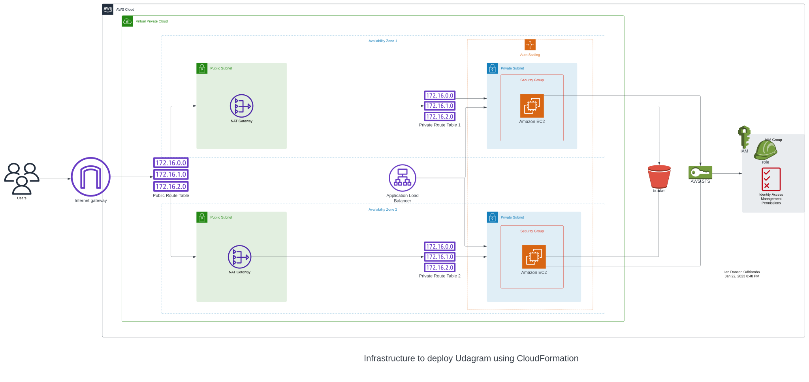
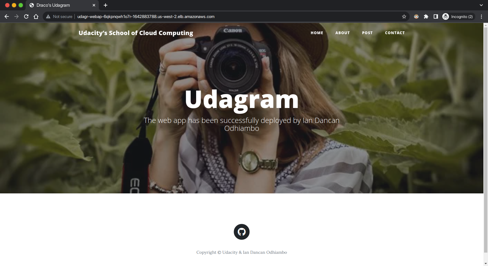

# Infrastructure as Code (IAC): Deploy a high-availability web app using CloudFormation

## Table of Contents

* [Introduction](#introduction)
* [Dependencies](#dependencies)
* [Project Instructions](#project-instructions)
  * [Scenario](#scenario)
  * [Server specs](#server-specs)
  * [Security Groups and Roles](#security-groups-and-roles)
* [My Solution](#my-solution)
  * [Final Results](#final-results)

## Introduction

This project was submitted as a final project for the Infrastructure As Code (IAC)
topic of [Udacity](https://www.udacity.com/ "Udacity")'s
[Cloud Devops Engineer Nanodegree](https://www.udacity.com/course/cloud-dev-ops-nanodegree--nd9991).

A realistic scenario requiring one to deploy a dummy application (a sample JavaScript or HTML file)
to the Apache Web Server running on an EC2 instance was chosen for this project.

## Dependencies

* [AWS account](https://aws.amazon.com/ "AWS") (& [AWS CLI](https://aws.amazon.com/cli/ "AWS CLI"))
* A code editor, such as [VS Code](https://code.visualstudio.com/ "Visual Studio Code")
* [Lucidchart](https://www.lucidchart.com/pages/ "Lucidchart") account

## Project Instructions

### Scenario

Your company is creating an Instagram clone called Udagram.

Developers want to deploy a new application to the AWS infrastructure.

You have been tasked with provisioning the required infrastructure
and deploying a dummy application, along with the necessary supporting software.

### Server specs

1. You'll need to create a **Launch Configuration** for your application servers
in order to deploy four servers, two located in each of your private subnets.
The launch configuration will be used by an auto-scaling group.

2. You'll need two vCPUs and at least 4GB of RAM.
The Operating System to be used is Ubuntu 18.
So, choose an Instance size and Machine Image (AMI) that best fits this spec.

3. Be sure to allocate at least 10GB of disk space so that you don't run into issues.

### Security Groups and Roles

1. Since you will be downloading the application archive from an **S3 Bucket**,
you'll need to create an **IAM Role** that allows your instances to use the S3 Service.

2. Udagram communicates on the default `HTTP Port: 80`,
so your servers will need this inbound port open since you will use it with the **Load Balancer**
and the **Load Balancer Health Check**. As for outbound, the servers will need unrestricted internet access
to be able to download and update their software.

3. The load balancer should allow all public traffic `(0.0.0.0/0)` on `port 80` inbound,
which is the default HTTP port. Outbound, it will only be using `port 80` to reach the internal servers.

4. The application needs to be deployed into private subnets with a **Load Balancer** located in a public subnet.

5. One of the output exports of the **CloudFormation** script should be the public URL of the **LoadBalancer**.
**Bonus points** if you add `http://` in front of the load balancer **DNS Name** in the output, for convenience.

## My Solution

Taking the project guidelines and the project rubric into consideration,
I came up with the following infrastructure diagram for the deployment of Udagram:



This image was interpreted into a [CloudFormation template script](./udagram.yml "Template script")
and [Parameters script](./udagram-params.json "Parameters file").

The [create.sh](./create.sh) script was used to create stacks.
Usage:

```zsh
~$ ./create.sh myStack myStackTemplate.yml myStack-params.json
```

Where:

* `myStack` is the name of the stack to be created
* `myStackTemplate.yml` is the template script for the stack
* `myStack-params.json` is the parameters file

Similarly, the [update.sh](./update.sh) script can be used to update an existing stack:

```zsh
~$ ./update.sh myStack myStackTemplate.yml myStack-params.json
```

The [delete.sh](./delete.sh) script deletes the stack. The name of the stack is passed to it:

```zsh
~$ ./delete.sh myStack
```

### Final Results

The screenshot below showcases successful deployment of a dummy website by the scripts.



The resources were then successfully deleted after the success of the exercise.
